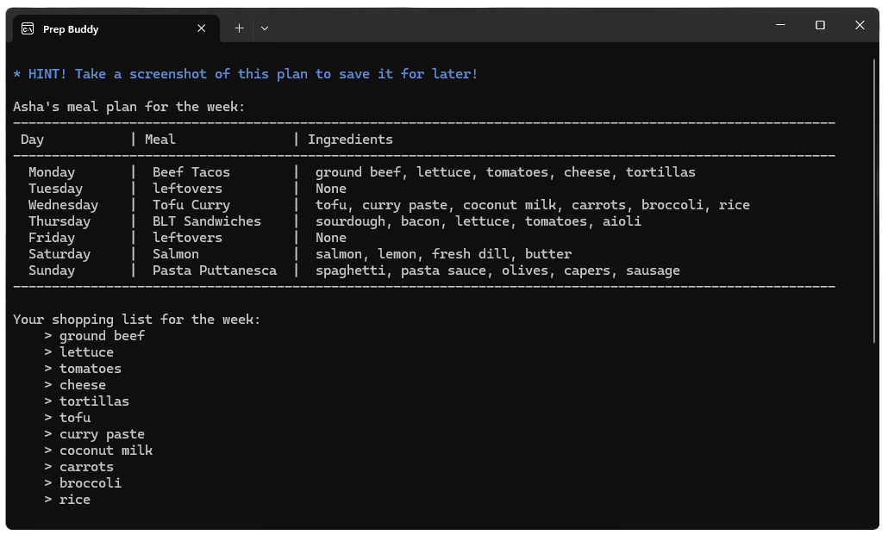

<html>
    <head>
        <meta charset="UTF-8">
        <meta name="viewport" content="width=device-width, initial-scale=1.0">
        <link rel="stylesheet" href="styles.css">
        <link href="https://fonts.googleapis.com/css2?family=Open+Sans:ital,wght@0,300..800;1,300..800&display=swap" rel="stylesheet">
        <title>apeissigma - Git Portfolio</title>
    </head>
    <body>
        

            <aside>
                
                <h1 class="center">Ashani Li Peissigma</h1>
                <h3 class="center">📍Chicago, IL</h3>
                
I'm a guy that likes to have fun. Year of the snake. Kaiju friend. Student of code.

                <h3>Skills</h3>
                <ul>
                    <li>HTML</li>
                    <li>CSS</li>
                    <li>Javascript</li>
                    <li>C#</li>
                </ul>
                <h3>Learning...</h3>
                <ul>
                    <li>C++</li>
                    <li>p5.js</li>
                </ul>
                <h3><a href="https://github.com/apeissigma" target="_blank">🔗 Github</a></h3>
            </aside>
            <main>
                <h1>My Projects</h1>
                <section>
                    <h2>Gimme Weather (WIP)<a href="" target="_blank">🔗</a></h2>
                    
Lorem ipsum dolor sit amet, consectetur adipiscing elit. Vivamus vitae aliquam nunc. Maecenas sit amet justo ut felis lobortis venenatis. Proin ultricies dolor porttitor egestas egestas. Aliquam euismod varius tristique. 

                        
                </section>
                <section>
                    <h2>Everybody Loves Cards!<a href="" target="_blank">🔗</a></h2>
                    
Lorem ipsum dolor sit amet, consectetur adipiscing elit. Vivamus vitae aliquam nunc. Maecenas sit amet justo ut felis lobortis venenatis. Proin ultricies dolor porttitor egestas egestas. Aliquam euismod varius tristique. 

                        
                </section>
                <section>
                    <h2>Ordle<a href="" target="_blank">🔗</a></h2>
                    
Lorem ipsum dolor sit amet, consectetur adipiscing elit. Vivamus vitae aliquam nunc. Maecenas sit amet justo ut felis lobortis venenatis. Proin ultricies dolor porttitor egestas egestas. Aliquam euismod varius tristique. 

                        
                </section>
                <section>
                    <h2>Prep Buddy<a href="" target="_blank">🔗</a></h2>
                    
A weekly meal planner console application demonstrating the principles of object oriented programming.

                        
                </section>
                <section>
                    <h2>Project 5 <a href="" target="_blank">🔗</a></h2>                
                    
Lorem ipsum dolor sit amet, consectetur adipiscing elit. Vivamus vitae aliquam nunc. Maecenas sit amet justo ut felis lobortis venenatis. Proin ultricies dolor porttitor egestas egestas. Aliquam euismod varius tristique. 

                </section>
            </main>
        

    </body>
</html>
