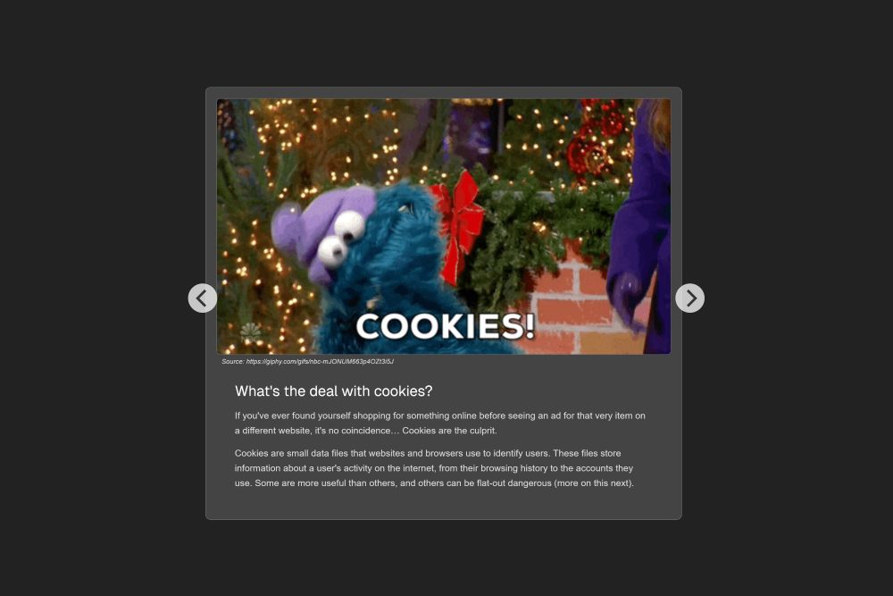
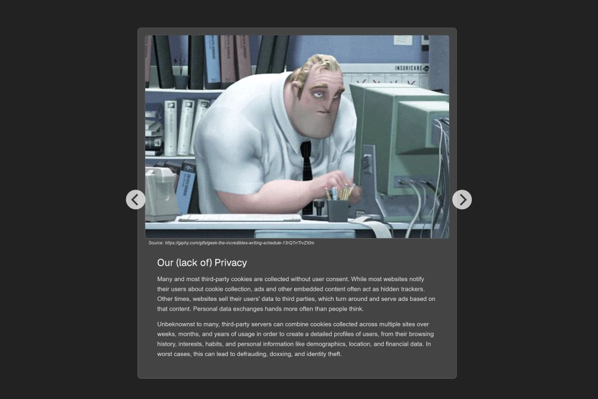
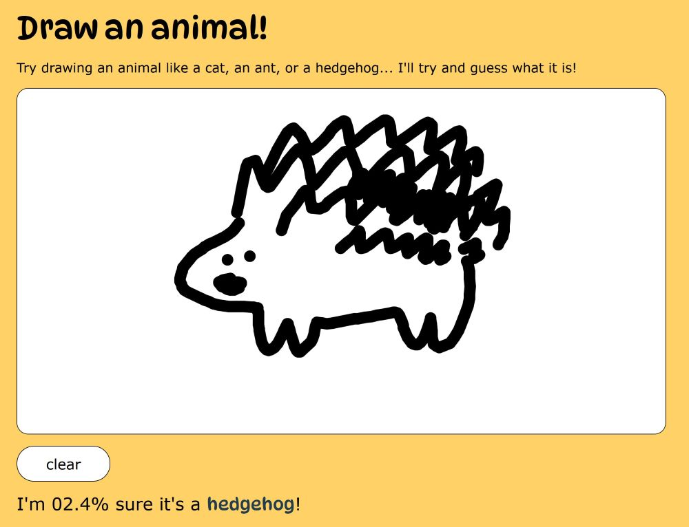
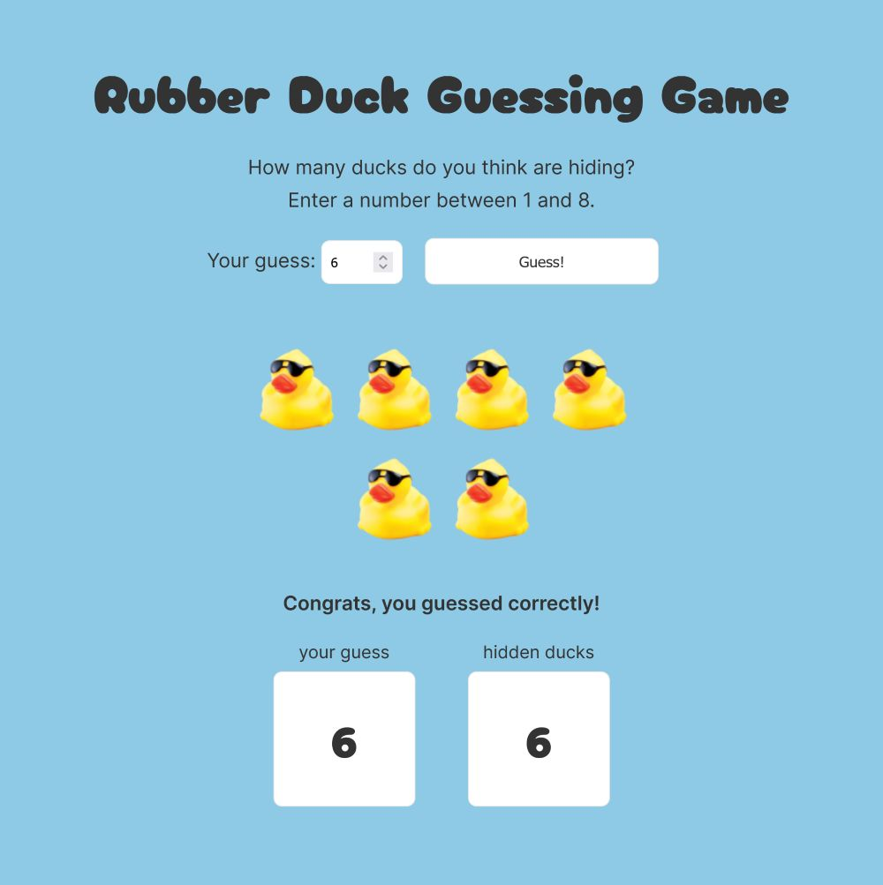
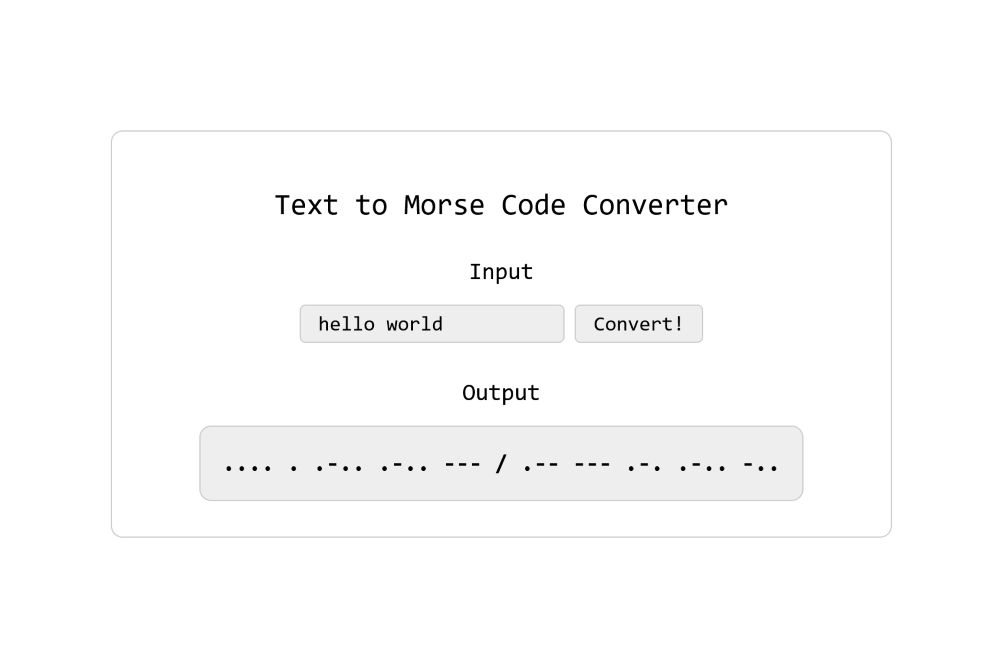

<html>
    <head>
        <meta charset="UTF-8">
        <meta name="viewport" content="width=device-width, initial-scale=1.0">
        <link rel="stylesheet" href="styles.css">
        <link href="https://fonts.googleapis.com/css2?family=Open+Sans:ital,wght@0,300..800;1,300..800&display=swap" rel="stylesheet">
    </head>
    <body>
        

            <aside>
                
                <h1 class="center">Ashani Li Peissigma</h1>
                
PROG102 Portfolio!

                <h3>Learning</h3>
                <ul>
                    <li>HTML/CSS/JS</li>
                    <li>C#</li>
                    <li>p5.js</li>
                    <li>SQL</li>
                    <li>MongoDB</li>
                </ul>
                <h3><a href="https://github.com/apeissigma" target="_blank">🔗 Github</a></h3>
            </aside>
            <main>
                <h1>My Projects</h1>
                <section>
                    <h2>Cookies & The Right to Anonymity on the Web</h2>
                    
This project’s topic was on data collection and privacy, as it impacts everyone, from users to designers to developers (the latter two being my discipline). I wanted to spread awareness about cookies by explaining what exactly they are, what they do, why they can be dangerous, and what the average internet user can do to protect their data online. Using my research, I created a small, interactive presentation using the Flickity JavaScript library. In my presentation, I also included a web developer’s perspective on the pros and cons of cookies, as well as how to implement them ethically. 

                        
                        
                </section>
                <section>
                    <h2>Doodle Guesser</h2>
                    
This project uses the p5.js and ml5.js JavaScript libraries to implement a web application that uses machine learning to guess what the user draws on the canvas. While the original code allowed the user to draw any subject, my application instructs users to draw an animal and displays the first (most confident) guess of type animal. The most challenging part of this project was working with the machine learning model, which often cannot guess correctly. While narrowing down the subject to be only an animal (45 possible animals total), the model struggled to guess anything that wasn’t a cat, ant, or hedgehog.

                        
                </section>
                <section>
                    <h2>Rubber Duck Guessing Game</h2>
                    
This project is a game where the user must guess how many ducks are “hiding,” with the amount of ducks generated randomly. While relatively simple, this project helped me practice creating and modifying DOM elements with JavaScript.

                        
                </section>
                <section>
                    <h2>Morse Code Converter</h2>
                    
This project converts input strings into Morse code. To solve this challenge, I created an array of characters and their associated Morse codes. The application takes the input and converts it into a character array, iteratively searches for the character, and appends the associated Morse code to the final output string.

                        
                </section>
                <section>
                    <h2>Suprematism Composition Generator</h2>
                    
The project uses the p5.js JavaScript library to create randomly generated compositions of different shapes and colors. The initial randomness reminded me of early Bauhaus posters and the Suprematism movement, so I decided to run with that style. This concept evolved into an application that lets users customize the parameters to change the amount of shapes generated.

                        
                </section>
            </main>
        

    </body>
</html>
