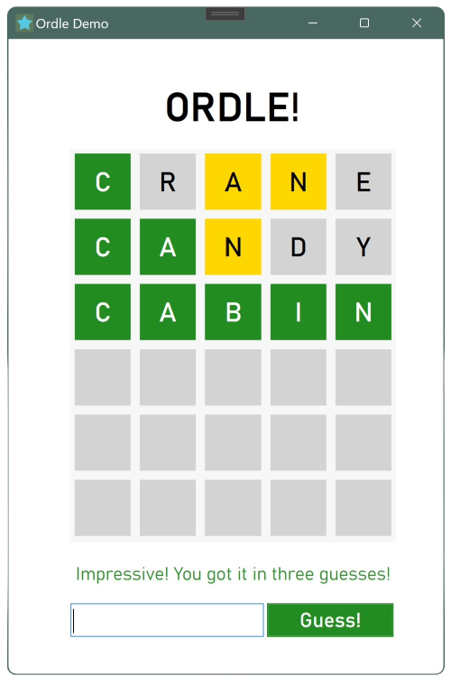

<html>
    <head>
        <meta charset="UTF-8">
        <meta name="viewport" content="width=device-width, initial-scale=1.0">
        <link rel="stylesheet" href="styles.css">
        <link href="https://fonts.googleapis.com/css2?family=Open+Sans:ital,wght@0,300..800;1,300..800&display=swap" rel="stylesheet">
    </head>
    <body>
        

            <aside>
                
                <h1 class="center">Ashani Li Peissigma</h1>
                
PROG201 Portfolio!

                <h3>Skills</h3>
                <ul>
                    <li>HTML/CSS/JS</li>
                    <li>C#</li>
                </ul>
                <h3>Learning...</h3>
                <ul>
                    <li>C++</li>
                    <li>p5.js</li>
                </ul>
                <h3><a href="https://github.com/apeissigma" target="_blank">🔗 Github</a></h3>
            </aside>
            <main>
                <h1>My Projects</h1>
                <section>
                    <h2><a href="https://github.com/apeissigma/WeatherMoment">Weather Moment</a></h2>
                    
A WPF application that displays current weather information per the user’s geographic area. The code of this application builds on foundational C# and OOP principles while incorporating external API calls and data binding.

                        
                        
                </section>
                <section>
                    <h2><a href="https://github.com/apeissigma/EverybodyLovesCards">Everybody Loves Cards!</a></h2>
                    
A modular console application for card games, including the games “High or Low,” “Same or Different,” and “Highest Match.” The code of this application incorporates polymorphism, inheritance, and separation of concern to construct a card game framework where new games can be created easily.

                        
                        
                </section>
                <section>
                    <h2><a href="https://github.com/apeissigma/Ordle">Ordle</a></h2>
                    
A “Wordle” WPF application where the player has six chances to guess a five-letter word. Demonstrates loading in external data and dynamically generating WPF elements.

                        
                <section>
                    <h2><a href="https://github.com/apeissigma/ProgrammingQuiz">Programming Quiz</a></h2>
                    
A command-line application utilizing the dictionary collection class and external data loading through System.IO. Users can view all terms, search for a specific term keys, and take a randomly generated 10-question quiz.

                        
                </section>
                <section>
                    <h2><a href="https://github.com/apeissigma/Creature-World">Creature World</a></h2>
                    
A command-line game where the user can navigate to different locations in Chicago (objects derived from a base location class) and meet different “creatures” (human and animal objects derived from a base creature class). Demonstrates the use of delegates for utility methods and interfaces.

                        
                </section>
                <section>
                    <h2><a href="https://github.com/apeissigma/PrepBuddy">Prep Buddy</a></h2>
                    
A weekly meal planner command-line application demonstrating the principles of object oriented programming. Users can add a recipe and its ingredients to a formatted table to help them plan meals for the week. 

                        
                </section>
                <section>
                    <h2><a href="https://github.com/apeissigma/PrepBuddyWPF">Prep Buddy WPF</a></h2>                
                    
A port of the command-line Prep Buddy project into WPF. Utilizes saving and loading external data, allowing users to save plans in a text file that can be retrieved or overridden later.

                        
                </section>
            </main>
        

    </body>
</html>
